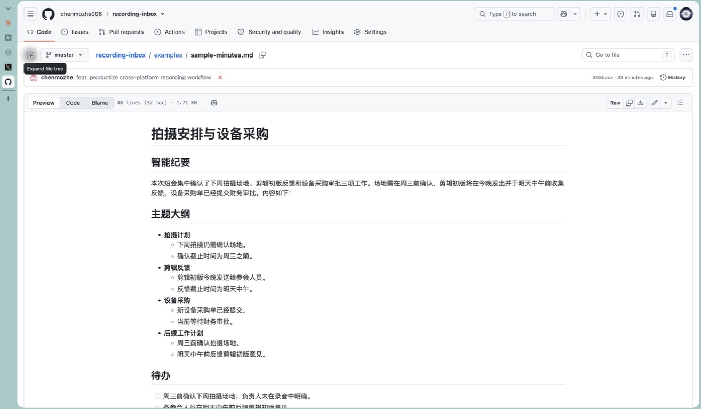

**简体中文** | [English](README.en.md)

# recording-inbox - 开源 AI 录音工作流

录完上传，剩下不用管：把手机或电脑里的录音放进飞书云盘，Mac 或 Windows 自动完成录音转文字、本地转写、AI 智能纪要、飞书归档和结果通知。

[](docs/setup-macos.md)
[](docs/setup-windows.md)
[](https://github.com/chenmozhe008/recording-inbox/actions/workflows/ci.yml)
[](LICENSE)

适合会议、采访、课程、客户沟通等大量长录音。你不用再逐条下载、转写、复制、整理和归档，也不用一直盯着处理进度。

## 为什么会需要它？

录音本身很容易，真正费时间的是录完以后：上传到不同工具、等待转写、整理重点、提取待办、重新命名，再把结果放回团队正在使用的地方。

`recording-inbox` 不是单独的语音转文字脚本，而是一套可以长期运行的 AI 录音工作流。你只负责录音和上传，电脑负责转写、会议录音自动总结、提取待办和归档；完成后，结果仍然回到飞书，而不是散落在另一个临时工具里。

## 核心优势

| 优势 | 对你有什么用 |
|---|---|
| 本地开源转写 | FunASR / SenseVoice 在自己的电脑上运行，不消耗飞书妙记转写分钟数，适合大量、长期和长录音 |
| 不只是逐字稿 | 自动生成标题、总览、主题大纲、待办、章节、关键决策和文字记录 |
| 手机和电脑统一入口 | iPhone、Android、微信下载音频和电脑文件都进入同一个飞书 inbox |
| 默认好用，也能按场景改 | 默认使用成熟的通用智能纪要，另有客户、访谈、播客、课程、培训、项目、调研、复盘和口述模板 |
| 关机重启能续跑 | 电脑临时关机、程序中断或通知失败后，会从已有阶段继续，避免重复转写和重复建文档 |
| 隐私和费用更可控 | 音频转写不交给第三方转写服务；只有启用 AI 纪要时，文字才会发送给你选择的模型 API |
| 普通用户也能部署 | 支持 macOS、Windows 10/11；可让自己常用的 AI 编程工具按说明安装和自检 |

本地转写不按分钟收费，但电脑运行、电力以及可选的 AI 纪要 API 仍可能产生少量成本。本项目强调的是可控和可持续，不宣传无法保证的“绝对零成本”。

## 适合这些场景

- 每天会议很多，希望录完自动形成结构化纪要；
- 采访、调研和客户沟通时间长，人工整理成本高；
- 课程、培训、直播或播客录音需要持续沉淀为文字资料；
- 团队已经使用飞书，希望上传、通知、文档和后续协作都留在飞书；
- 对纪要格式、行业术语和待办提取有自己的要求，不想被固定模板限制。

## 30 秒看懂


电脑临时关机没有关系：录音留在飞书 inbox，开机后自动接着处理。电脑关机时本地程序无法主动发“离线通知”，真正接手、完成或失败后才会通知。

## 它和飞书妙记怎么选？

| 你的情况 | 更合适的选择 | 原因 |
|---|---|---|
| 偶尔转几条，希望手机里一步完成 | 飞书妙记 | 原生体验更省事，不值得为少量录音部署电脑端服务 |
| 长录音多，转写额度经常不够 | recording-inbox | 本地转写不消耗妙记分钟数，可持续批量处理 |
| 想自定义纪要结构和行业术语 | recording-inbox | 模板和提示词由自己控制 |
| 需要关机后继续、失败后重试 | recording-inbox | 每条录音都有独立任务状态和恢复机制 |
| 不使用飞书 | 其他工具 | 本项目把飞书作为上传、归档和通知入口 |

本项目不是飞书妙记的完整复刻。它解决的是“大量录音、本地转写、自定义整理、结果仍回到飞书”这条链路。

## 最快安装

### 方式 A：让 AI 工具帮你安装

把下面这段发给你已经在用的 AI 编程工具即可。比如 Claude Code、Codex、Gemini CLI、Cursor、Windsurf、GitHub Copilot、Cline、Roo Code、Qoder、CodeBuddy、Trae、WorkBuddy、龙虾、Hermes 或 zcode；这不是限定名单。

```text
帮我部署 https://github.com/chenmozhe008/recording-inbox
根据我的电脑选择 macOS 或 Windows 安装路径。
需要扫码、粘贴飞书文件夹链接或填写 API Key 时再让我操作，
最后必须跑环境自检和模拟测试。
```

### 方式 B：自己安装

- [macOS 完整安装](docs/setup-macos.md)
- [Windows 10/11 完整安装](docs/setup-windows.md)

安装核心依赖后，两边都用同一个配置向导：

```bash
python scripts/setup.py
python scripts/setup_check.py
```

向导会让你完成：

1. 粘贴飞书 inbox 和纪要输出文件夹链接；
2. 直接使用默认智能纪要，或按需要选择其他场景模板；
3. 安全输入模型 API Key（默认推荐 DeepSeek V4 Flash，只写本机 `.env`）；
4. 自动识别当前飞书账号，用已有授权直接给自己发结果消息。

不需要手工截取 folder token，也不需要为了通知创建群机器人 Webhook。

## 日常使用

| 录音在哪里 | 推荐上传方法 |
|---|---|
| 电脑、微信或网盘 | 直接拖进飞书 inbox，最简单 |
| iPhone 语音备忘录 | 存到“文件” → 飞书“云盘” → inbox → 右下角“上传” → 选择文件 |
| Android 系统录音机 | 飞书“云盘” → inbox → 右下角“上传” → 选择录音 |

第一次找到 inbox 后，可以把它加入飞书“收藏”，以后少找一层目录；不收藏也不影响上传。完整步骤见 [手机和电脑上传教程](docs/upload-from-phone.md)。

飞书移动端不同版本里，“云盘”可能显示为“云文档”，上传按钮也可能显示为 `+`。进入 inbox 后选择“上传文件”即可。

手机只负责上传，电脑负责转写和整理。默认每分钟检查一次新录音。

## 结果长什么样？



截图来自仓库内的 [脱敏示例纪要](examples/sample-minutes.md)，展示标题、摘要、主题大纲和待办的实际排版。

每条录音会生成两篇独立的飞书文档：

```text
智能纪要
主题大纲
待办
智能章节
关键决策
金句时刻

文字稿
带时间戳的完整文字记录
```

完成后飞书只发送一条通知，其中提供“打开智能纪要”和“打开文字稿”两个入口。标题会根据内容生成；单人录音不会显示没有意义的“说话人1”，多人录音会保留编号区分观点。查看 [脱敏结果示例](examples/sample-minutes.md) 和 [对应文字记录](examples/sample-transcript.txt)。

这意味着你拿到的不是一份需要重新阅读和加工的原始文本，而是一组可分别浏览、检索、分享和继续协作的工作文档。

## 自定义纪要

`config.json` 中选择内置模板：

```json
"summary_template": "meeting"
```

默认直接使用 `meeting`，它是经过真实使用调整的通用智能纪要。其他可选值：

- `meeting`：默认智能纪要（推荐）
- `customer`：客户沟通
- `interview`：访谈整理
- `podcast`：自媒体 / 播客
- `course`：课程笔记
- `training`：培训 / 分享
- `project`：项目沟通
- `research`：调研 / 座谈
- `review`：工作复盘
- `dictation`：灵感口述

想完全自定义，就把要求写进一个 Markdown 文件，再填写：

```json
"summary_prompt_file": "prompts/my-template.md"
```

内置模板都在 [prompts](prompts/README.md)，可以直接复制修改。

## 稳定性和恢复

- 每条录音有独立任务包和状态，不靠内存记进度。
- 电脑关机或进程中断后，会从转写、纪要或发布阶段继续。
- 上一轮真的还在运行时，新一轮会跳过，避免重复转写。
- 断电留下的死锁会在开机后立即清理，不会再等待数小时。
- 同一飞书文件只处理一次；原音频处理后移入 inbox 的 `processed` 子文件夹。
- 纪要已发布但通知失败时，只补发通知，不重复创建文档。

状态和排错位置见 [故障恢复指南](docs/troubleshooting.md)。

## 隐私和费用

- 音频转写在本机运行，不上传第三方转写服务。
- 开启智能纪要后，文字记录会发送给你配置的 LLM API。
- 不需要 AI 纪要时，可把 `summary_enabled` 设为 `false`。
- API Key 只放 `.env`，不要粘进聊天、截图、README 或 `config.json`。
- 默认推荐 DeepSeek V4 Flash：当前价格很低，常见纪要调用的模型费用通常可以忽略，但不是绝对零成本。
- 也可以使用任何兼容 OpenAI Chat Completions 的模型服务，只需替换 API 地址、模型名和 Key 环境变量名。
- 模型价格和名称会变化，请以 [DeepSeek 官方价格页](https://api-docs.deepseek.com/zh-cn/quick_start/pricing)或所选服务商文档为准。

详细配置见 [模型 API 与 Key 安全说明](docs/setup-api.md)。

## 第一次使用建议

1. 先上传一条 30 秒以上、能听清人声的录音；
2. 在飞书 inbox 确认文件已经出现；
3. 保持处理电脑开机联网，等待飞书完成通知；
4. 没有收到结果时，按 [故障恢复指南](docs/troubleshooting.md) 排查。

## 文档导航

- [macOS 安装](docs/setup-macos.md)
- [Windows 10/11 安装](docs/setup-windows.md)
- [飞书文件夹和消息授权](docs/setup-feishu-app.md)
- [iPhone / Android / 电脑上传](docs/upload-from-phone.md)
- [DeepSeek API 与 Key](docs/setup-api.md)
- [故障恢复](docs/troubleshooting.md)
- [纪要模板](prompts/README.md)
- [结果示例](examples/sample-minutes.md)
- [AI 录音工作流常见问题](docs/faq.md)
- [独立项目页](https://chenmozhe008.github.io/recording-inbox/)

## 项目边界

这个仓库刻意保持轻量，只做：拉取、转写、纪要、发布和通知。

它不会加入私有主系统里的多维表工作台、每日确认卡、任务分流、Codex/Claude 自动执行或 iOS App。保持边界清楚，普通用户才有可能自己装好并维护。

## 参与和反馈

遇到问题，请按 [贡献指南](CONTRIBUTING.md) 提 Issue。附上系统版本、执行步骤、`status.json` 状态和已脱敏日志，比只说“不能用”更容易定位。

如果这个项目帮你省下了整理录音的时间：

1. 点一个 Star，让更多需要大量录音转写的人看到它；
2. 把 [脱敏结果示例](examples/sample-minutes.md) 发给可能用得上的同事；
3. 分享时只介绍自己实际使用过的能力，并使用脱敏录音和截图；
4. 遇到问题或有通用改进，提交 Issue 或 PR。

## License

[MIT](LICENSE)
